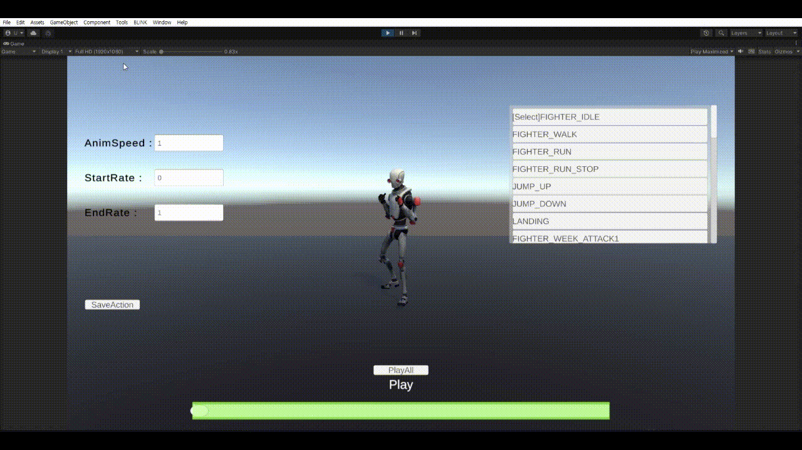
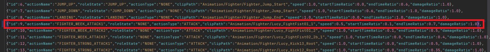

# zxcvProject
zxcv 키 사용 게임 제작

# 현재 조작법
    - 이동 : 방향키
    - 점프 : V
    - 주먹 공격 : C>C>C
    - 발차기 공격 : X>X
    - 점프 공격 : V>C>C>C

# 현재 개발 중인 Scene
    - DevScene
    - MoveSetScene

# 구현된 State
    - 기본 상태 모션(eState.IDLE)
    - 걷기 모션(eState.WALK)
    - 달리기 모션(eState.RUN)
    - 달리기 급정지 모션(eState.RUNSTOP)
    - 점프 상승 모션(eState.JUMP_UP)
    - 점프 하강 모션(eState.JUMP_DOWN)
    - 착지 모션(eState.LANDING)
    - 주먹 콤보1 모션(eState.ATTACK)
    - 주먹 콤보2 모션(eState.ATTACK2)
    - 주먹 콤보3 모션(eState.ATTACK3)
    - 발차기 콤보1 모션(eState.ATTACK4)
    - 발차기 콤보2 모션(eState.ATTACK5)
    - 기상 피격 모션(eState.NORMAL_DAMAGED)
    - 에어본 공격 피격 모션(eState.AIRBORNE_DAMAGED)
    - 에어본 피격 도중 재피격 모션(eState.DAMAGED_AIRBORNE_LOOP)
    - 에어본 피격도중 바닥 충돌 모션(eState.DAMAGED_LANDING)
    - 아이템 습득 모션(eState.GET_ITEM)
    - 기상 모션(eState.WAKE_UP)
    - 죽음 모션(eState.DEAD)

# DevScene
## 플레이 영상

# MoveSetScene
## 액션 재생 및 제어

## 액션 수정 후 Json으로 저장

## 저장 결과
